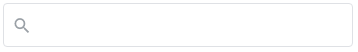

# Why i using react-search?

<ul>
  <li>The first reason for using it is that it is open source</li>
  <li>Updates happen frequently. There is constant news</li>
  <li>Easy to use. Files are sorted for more information <b>content/filestructure.yml</b></li>
  <li>We usually use CSS. No frameworks and support packages</li>
  <li>Fast loading and fast action</li>
</ul>
<br/>
<p align="center">
Input without result, searched<br/><br/>

</p>
<br/>
<p align="center">
Input with list<br/><br/>

</p>
<br/>
<p align="center">
Input With Searched<br/><br/>

</p>

<p>The example below ensures that all items in JSON are retrieved and sorted by search. You will notice a strange removeItem pointer performing a deletion of an item in JSON. Depending on which one the user chooses to search. react-search is not a framework nor a package it is a simple code that helps you not to rewrite the same code several times in different projects</p>

```jsx
{
  renderData.length > 0 && (
    <div className="container-searchList">
      {renderData
        .filter((val) => {
          if (val.title.toLowerCase().includes(input.toLowerCase())) {
            return val;
          }
        })
        .map((item) => {
          const { id } = item;
          return (
            <>
              <SearchChildList {...item} removeItem={() => removeItem(id)} />
            </>
          );
        })}
    </div>
  );
}
```

<p>In the example below we will process a popup and we will indicate that it will process the photo, name, and ID. Hopefully the code is very easy to write and easy to modify and is built entirely on the 2 useState method. Which handles the entire code.</p>

```jsx
<div className="content-searchList" key={id}>
  <div className="flex">
    
    <p className="mleft">{title}</p>
  </div>
  <div>
    <button className="close-btn" onClick={removeItem}>
      ×
    </button>
  </div>
</div>
```

## Contributing

The main purpose of this repository is to continue evolving React Search core, making it faster and easier to use. Development of React Search happens in the open on GitHub, and we are grateful to the community for contributing bugfixes and improvements. Read below to learn how you can take part in improving React Search.

## [Code of Conduct](CODE_OF_CONDUCT.md)

React Search has adopted a Code of Conduct that we expect project participants to adhere to. Please read the full text so that you can understand what actions will and will not be tolerated.

## [Contributing Guide](CONTRIBUTING.md)

Read our contributing guide to learn about our development process, how to propose bugfixes and improvements, and how to build and test your changes to React Search.

## License

React Search is [MIT licensed](LICENSE)
